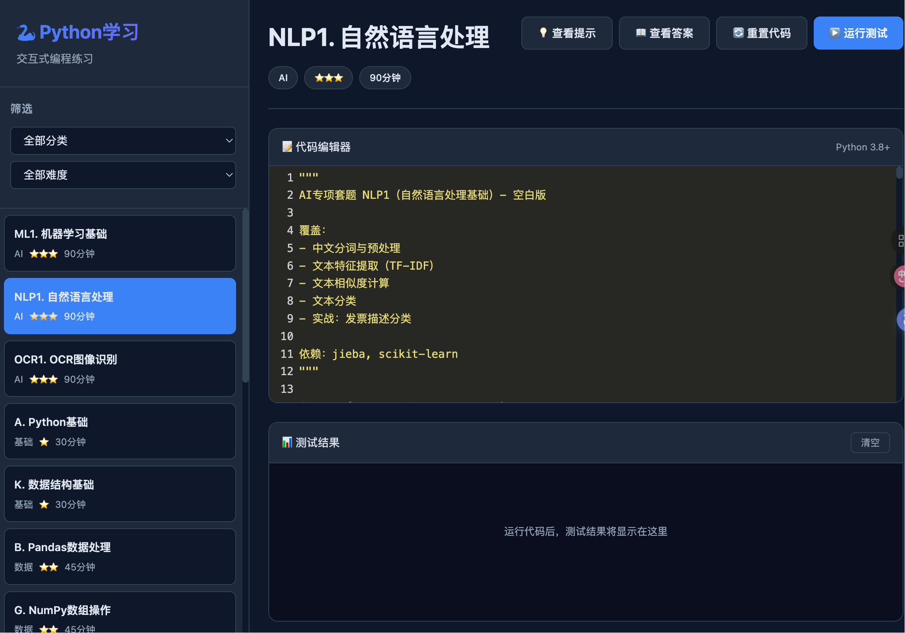

# 📚 文档中心

欢迎来到 Python 学习平台文档中心！这里包含了所有的学习资源、指南和参考文档。

---

## 📖 文档导航

### 🚀 [入门指南](getting-started/)

新手必读，快速上手项目：

- **[快速开始](getting-started/QUICK_START.md)** - 5分钟快速体验
- **[入门教程](getting-started/GETTING_STARTED.md)** - 详细的入门指南
- **[常见问题](getting-started/FAQ.md)** - 常见问题解答

### 📚 [学习资源](learning/)

系统化的学习路径和知识体系：

- **[学习路径](learning/LEARNING_PATH.md)** - 8个阶段的完整学习路径
- **[知识图谱](learning/KNOWLEDGE_MAP.md)** - Python知识体系全景图
- **[项目总结](learning/PROJECT_SUMMARY.md)** - 项目概览和特性介绍

### 🎯 [面试准备](interview/)

AI工程师面试准备资源：

- **[面试准备度分析](interview/INTERVIEW_READINESS_ANALYSIS.md)** - 评估你的准备情况
- **[7天冲刺指南](interview/INTERVIEW_SPRINT_GUIDE.md)** - 面试前的冲刺计划

### 📋 [速查表](cheatsheets/)

快速参考和常用代码片段：

- **[AI技能速查表](cheatsheets/AI_CHEATSHEET.md)** - ML/NLP/OCR核心API
- **[税务计算速查表](cheatsheets/TAX_CHEATSHEET.md)** - 个税、增值税计算公式

### 🤖 [AI增强文档](ai-enhancement/)

AI技能提升相关文档：

- **[AI技能缺口分析](ai-enhancement/AI_SKILLS_GAP_ANALYSIS.md)** - 详细的技能评估
- **[AI增强总结](ai-enhancement/AI_ENHANCEMENT_SUMMARY.md)** - 改进记录
- **[AI优化完成报告](ai-enhancement/AI_OPTIMIZATION_COMPLETE.md)** - 最终成果

### 🌐 [Web平台文档](web-platform/)

Web学习平台使用指南：

- **[Web应用指南](web-platform/WEB_APP_GUIDE.md)** - 完整使用说明（含界面截图）
- **[演示文档](web-platform/WEB_APP_DEMO.md)** - 快速体验指南
- **[平台总结](web-platform/WEB_PLATFORM_SUMMARY.md)** - 技术细节

### 🔒 [安全文档](SECURITY.md)

Web平台安全说明：

- **[安全说明](SECURITY.md)** - 完整的安全架构和防护措施
- **[安全修复总结](SECURITY_FIX_SUMMARY.md)** - 任意代码执行漏洞修复详情
- **[安全检查清单](SECURITY_CHECKLIST.md)** - 部署和维护检查清单

### 🌍 [跨平台兼容性](PLATFORM_COMPATIBILITY.md)

不同操作系统的支持说明：

- **[平台兼容性指南](PLATFORM_COMPATIBILITY.md)** - Linux/macOS/Windows支持详情
- **[Windows用户指南](WINDOWS_GUIDE.md)** - Windows平台专用指南
- **[修复方案](PLATFORM_FIX_PLAN.md)** - 跨平台兼容性修复计划

### 🚀 [项目规划](FUTURE_ROADMAP.md)

项目后期功能规划和发展路线：

**通用规划**（适合公网大规模部署）:
- **[功能路线图](FUTURE_ROADMAP.md)** - 6个月功能规划，优先级矩阵
- **[架构演进](ARCHITECTURE_EVOLUTION.md)** - 从V1.0到V2.0的技术架构演进（PostgreSQL + Redis）
- **[项目规划看板](PROJECT_PLANNING.md)** - 详细的Sprint规划和里程碑

**单机/局域网版**（推荐，500人以内）:
- **[架构演进V2](ARCHITECTURE_EVOLUTION_V2.md)** - SQLite + Vue.js + Docker方案
- **[简化版路线图](ROADMAP_SIMPLIFIED.md)** - 3个月开发计划，快速上线

**技术选型**: SQLite（数据库）+ Vue.js（前端）+ Docker（部署）

  
  
<i>💡 查看 <a href="web-platform/WEB_APP_GUIDE.md">Web应用指南</a> 了解更多</i>

### 📝 [变更日志](CHANGELOG.md)

项目版本历史和更新记录

---

## 🎯 推荐阅读路径

### 新手入门
1. [快速开始](getting-started/QUICK_START.md)
2. [学习路径](learning/LEARNING_PATH.md)
3. [常见问题](getting-started/FAQ.md)

### AI工程师面试准备
1. [面试准备度分析](interview/INTERVIEW_READINESS_ANALYSIS.md)
2. [AI技能速查表](cheatsheets/AI_CHEATSHEET.md)
3. [7天冲刺指南](interview/INTERVIEW_SPRINT_GUIDE.md)

### Web平台使用
1. [Web应用指南](web-platform/WEB_APP_GUIDE.md)
2. [演示文档](web-platform/WEB_APP_DEMO.md)

---

## 🔍 快速查找

| 我想... | 查看文档 |
|---------|----------|
| 快速开始学习 | [快速开始](getting-started/QUICK_START.md) |
| 了解学习路径 | [学习路径](learning/LEARNING_PATH.md) |
| 准备面试 | [面试冲刺指南](interview/INTERVIEW_SPRINT_GUIDE.md) |
| 使用Web平台 | [Web应用指南](web-platform/WEB_APP_GUIDE.md) |
| 查看API参考 | [AI速查表](cheatsheets/AI_CHEATSHEET.md) |
| 解决问题 | [常见问题](getting-started/FAQ.md) |

---

## 📞 获取帮助

如果您在使用过程中遇到问题：

1. 查看 [常见问题](getting-started/FAQ.md)
2. 查看 [入门教程](getting-started/GETTING_STARTED.md)
3. 查看项目 [README](../README.md)

---

**返回 [项目主页](../README.md)**

